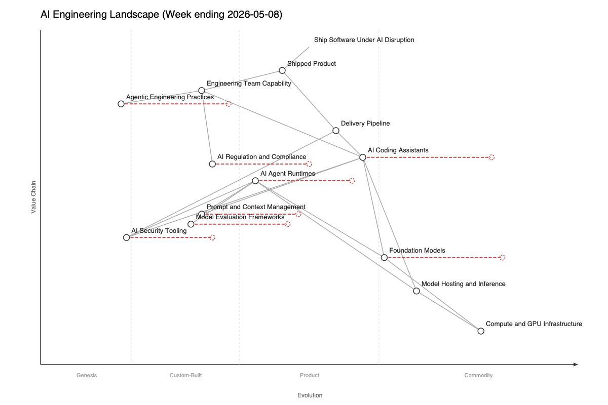

# AI Engineering Landscape

<!-- @jtbd: J1 (Awareness), J3 (Evaluation) -->

This is the living Wardley map underpinning the AI Engineering Brief. It tracks components in the external AI engineering domain that engineering leaders need to reason about as the tooling evolves. Not to be confused with `docs/wardley-map.md`, which maps this project's own value chain; that map is about the windyroad.com.au codebase, this map is about the industry engineering leaders operate inside. Each issue of the brief updates this map with new observations, and week-to-week diffs are visible in git.

## This week (ending 2026-05-08)

The dominant signal this week was tier-1 vendors building services businesses on top of their model layer. Anthropic announced an enterprise AI services company with Blackstone, Hellman & Friedman, and Goldman Sachs (May 4); Anthropic shipped a finance-vertical agent product (May 5); OpenAI announced a partnership with PwC to "reimagine the office of the CFO" (May 5); DeepMind introduced an AI co-clinician for healthcare. The AI Daily Brief named the pattern explicitly ("Why OpenAI and Anthropic Are Becoming Consultants", May 6). That cluster forces two updates. Engineering Team Capability shifted 0.27 to 0.30: vendor co-investment in capability has graduated from bilateral partnerships (last week's Anthropic-NEC, Theo Hourmouzis as ANZ GM) into productized services-business engagement at the joint-venture scale, and the joint venture with Goldman, Blackstone, and H&F is qualitatively different from a single-customer agreement because it productizes vendor-as-services-partner as a recurring revenue line. AI Agent Runtimes shifted 0.38 to 0.40 with evolve target 0.56 to 0.58 because three tier-1 labs shipped vertical-specific agent products in the same week (Anthropic finance, OpenAI/PwC for the CFO office, DeepMind co-clinician), which moves the runtime category from "platform you build agents on" toward "vertical agent products you buy", a step further into Product than the Symphony orchestration substrate marked last week. Model Evaluation Frameworks shifted 0.26 to 0.28 with evolve target 0.44 to 0.46 because the UK AISI's GPT-5.5 cyber capabilities evaluation (April 30) found GPT-5.5 to be the second model evaluated to successfully complete multi-step cyber-attack simulations end-to-end, which means evaluation frameworks now need to account for capability tiers tied to threat-model thresholds, not just benchmark scores; the AISI x Microsoft frontier safety partnership announced May 5 reinforces the same trajectory. AI Regulation and Compliance shifted 0.30 to 0.32 on the AISI x Microsoft partnership formalising sustained vendor-government compliance arrangements as a recurring artefact, plus the OAIC's RentTech (2Apply) determination on excessive personal-information collection (April 22) confirming privacy enforcement continuing in the same direction.

OpenAI shipped GPT-5.5 Instant (May 5) and announced new ways to buy ChatGPT ads (May 4); Foundation Models holds at 0.64 (frontier commoditisation is steady-state, the GPT-5.5 system card lineage is the third tier-1 frontier release at weekly cadence and a single Instant variant inside it does not move the position). DeepMind released Gemma 4 ("byte for byte the most capable open models", April), reinforcing the open-weight catch-up cadence already at weekly rather than quarterly; this is consistent with the 0.86 evolve target rather than triggering further movement.

Anthropic announced a compute deal with SpaceX alongside higher Claude usage limits (May 6), which combined with last week's Amazon 5GW deal and OpenAI's supercomputer networking framing (May 5) signals the compute-buildout floor under everything else on the map; Compute and GPU Infrastructure stays at commodity (0.10, 0.82) but the buildout pace is the substrate enabling the runtime productization above it.

Signal worth naming without map mutation: Google Chrome silently downloads a 4GB Gemini Nano AI model to user devices without consent (corroborated across PCWorld, Tom's Hardware, Decrypt, Yahoo Tech, gHacks; users who delete it find it reinstalled). This is a privacy and IT-policy event for any team operating a Chrome-managed fleet, and it sits on the AI Regulation and Compliance enforcement surface even though no regulator has acted on it yet. Microsoft killed the Xbox Copilot AI as part of an Xbox leadership overhaul (corroborated across The Verge, PC Gamer, Polygon, Windows Central, GamesIndustry.biz, Digital Trends): the first major-platform AI cancellation, which signals that AI features in consumer products are now subject to the same business-fit pruning as any other feature line.

Source coverage this week: tier-1 all succeeded (Anthropic direct, OpenAI via Google News RSS site:openai.com, DeepMind direct), so the map mutation gate stayed open. Tier-2 Reddit remained blocked at the tool layer (P014, expected). HN frontpage AI returned a thin RSS feed (1 item) but HN newest with 50+ points yielded the Chrome and Xbox stories. Tier-3 NIST returned 404, US FTC returned 403, OECD returned 404 (all expected per P010). The Chrome and Xbox candidates ran the Google News corroboration query at step 4b and both cleared with 5+ distinct primary outlets each, so they enter the shortlist as `CORROBORATED_PRIMARY`. The AI Daily Brief "Subsidy Era is Over" framing tagged `WEAK_ATTRIBUTION` and surfaced to Tom for keep/drop adjudication.

## This week (ending 2026-05-01)

The dominant signal this week was OpenAI shipping a second concentrated cluster inside a five-day window: GPT-5.3 and GPT-5.5 in ChatGPT (April 30) on top of last week's GPT-5.5 model and system card, OpenAI Symphony as an open spec for Codex orchestration (April 27), OpenAI Models, Codex, and Managed Agents coming to AWS (April 28), Codex rate card and Flexible Usage Credits in ChatGPT (April 28), and Cybersecurity in the Intelligence Age plus Building the Compute Infrastructure for the Intelligence Age (April 29). That cluster forces five updates. Foundation Models shifted 0.62 to 0.64 with evolve target 0.84 to 0.86 as GPT-5.5 and GPT-5.3 hitting ChatGPT inside two weeks of the GPT-5.5 system card lands a third tier-1 frontier release at weekly cadence; commoditisation is no longer accelerating, it is the steady state. AI Agent Runtimes shifted 0.34 to 0.38 with evolve target 0.52 to 0.56 because OpenAI Symphony is the second tier-1 lab to ship a first-party agent orchestration substrate (after the OpenAI Agents SDK v2 lineage), and Codex plus Managed Agents arriving on AWS makes the runtime distributable through a hyperscaler in addition to the vendor's own surface. AI Coding Assistants holds position 0.60 but evolve target moved 0.82 to 0.84 as Claude for Creative Work (April 28) expands the assistant surface from coding into general design and creative work, the same commoditisation moving laterally rather than further right. Engineering Team Capability shifted 0.25 to 0.27 on the Anthropic-NEC partnership for Japan's largest AI engineering workforce (April 24) and Theo Hourmouzis taking the Anthropic ANZ GM role with a formal Sydney office (April 27); for the first time a tier-1 lab is co-investing at scale in vendor-led regional and national talent pipelines, which is a new dimension on the team-capability axis that was previously fully internal. AI Regulation and Compliance shifted 0.28 to 0.30 with evolve target 0.48 to 0.50 on the Google-Pentagon agreement covering "any lawful" AI use (The Verge, corroborated across multiple primary outlets) introducing a defence carve-out as a recurring governance pattern, plus Anthropic's election safeguards update (April 24) showing vendor-led compliance reporting becoming a recurring artifact. Model Evaluation Frameworks shifted 0.24 to 0.26 as the UK AISI shipped two consecutive papers (April 27, April 28) raising the integrity bar for benchmarks: "Evaluating whether AI models would sabotage AI safety research" and "Ask Don't Tell: Reducing Sycophancy in Large Language Models" together signal that benchmark design now has to account for eval-aware models and prompt-conditional behaviour. AI Security Tooling shifted 0.14 to 0.16 with evolve target 0.30 to 0.32 as OpenAI's "Cybersecurity in the Intelligence Age" framing (April 29) is the second consecutive week a tier-1 lab is carrying named AI-security product P&L rather than research, and the Mercor 4TB voice-data breach exposing 40,000 AI training contractors (Hacker News, attribution to a security blog with TechCrunch corroboration on a related earlier LiteLLM incident) surfaces AI training-data labour pipelines as an attack surface the map had not previously named.

Apple's CEO transition is a signal worth naming without map mutation: Tim Cook stepping back and John Ternus being appointed CEO with AI strategy named as the defining challenge (LA Times, CNBC, Business Insider corroborated). The Apple ecosystem now faces the same vendor-tier-which-model decision the GitHub-Copilot-Opus pricing event surfaced last week; the Tim Cook transition is an inflection on AI Coding Assistants commoditisation when the consumer-platform category leader confirms its successor's mandate. The Zig project's formal anti-AI contribution policy (April 30, surfaced via Simon Willison and HN) is also worth naming: a counter-pattern in agentic engineering practices, a credible technical project explicitly refusing AI-generated contributions, which signals the practice is real enough that opting out has become a defensible position.

Source coverage this week: tier-1 all succeeded (Anthropic direct, OpenAI via Google News RSS site:openai.com workaround for the third consecutive edition, DeepMind direct), so the map mutation gate stayed open. Tier-2 Reddit remained blocked at the tool layer (P014, expected). Tier-3 NIST returned 404, US FTC returned 403, OECD returned 404, all expected per P010. The Mercor breach corroboration query found only TechCrunch on the primary-outlet allowlist, and that piece is dated March 31 framing a related but distinct LiteLLM compromise rather than the April 28 voice-samples incident; tagging the Mercor item WEAK_ATTRIBUTION and surfacing to Tom for keep/drop adjudication is the P016-correct path.

## This week (ending 2026-04-24)

The dominant signal this week was OpenAI shipping the GPT-5.5 cluster inside a single 48-hour window: the GPT-5.5 model plus its system card (April 23), a GPT-5.5 Bio Bug Bounty (April 23), Workspace Agents in ChatGPT (April 22), an OpenAI Privacy Filter (April 22), HealthBench Professional for clinician-chat evaluation (April 22), and a WebSockets path in the Responses API for agent workflows (April 22). That cluster forces several updates. Foundation Models shifted 0.60 to 0.62 with evolve target 0.82 to 0.84, reflecting GPT-5.5 landing on top of Claude Opus 4.7 from last week and Gemma 4 open weights; frontier commoditisation is running at weekly cadence across three labs simultaneously. AI Agent Runtimes shifted 0.32 to 0.34 with evolve target 0.50 to 0.52 on OpenAI Workspace Agents arriving as a first-party enterprise product, the Responses API gaining a WebSocket path, and UK AISI research showing sandboxed agents can infer their evaluation environment (which accelerates the move from "build your own runtime" toward "buy a governed runtime"). AI Security Tooling shifted 0.12 to 0.14 with evolve target 0.28 to 0.30: this is the first week a tier-1 lab has shipped named security products (GPT-5.5 Bio Bug Bounty, OpenAI Privacy Filter) rather than framing safety as research, which is the maturation signal this component has been waiting for. Prompt and Context Management shifted 0.28 to 0.30 with evolve target 0.45 to 0.48 as Workspace Agents codifies a context-handling surface. Model Evaluation Frameworks shifted 0.22 to 0.24 with evolve target 0.42 to 0.44 as OpenAI HealthBench Professional enters the field as a vendor-run vertical benchmark, adding a concrete pattern to copy while the AISI result raises the integrity bar for any benchmark.

AI Regulation and Compliance did not move on position (holds at 0.28, evolve target 0.48) but the trajectory is confirmed: the OAIC issued a determination against 2Apply (April 22) for excessive personal-information collection, the OAIC and eSafety signed a joint coordination agreement (April 23), and the training-data-defaults pattern visible in Atlassian (default-on customer data) and Meta (employee mouse and keystroke data) is the same enforcement surface. Agent Runtimes and Regulation are now moving in the same direction at similar pace, which tightens the reassess window for runtime-investment decisions named in the Decisions section.

Signal worth naming without map-mutation: GitHub restricted Claude Opus 4.7 to Copilot premium tiers (April 22), citing agentic-workflow compute demands; this is the commoditisation-with-pricing-tiers face of AI Coding Assistants without a position change. The "three-dimensional coding-assistant decision" (vendor, tier, which model sits behind the tool) is now codified as a weekly reality.

Source coverage this week: OpenAI direct fetch again returned a Cloudflare challenge on both primary and retry; the Google News RSS workaround (site:openai.com) surfaced the GPT-5.5 cluster and all April 22 items, so the tier-1 gate was satisfied on effect although the direct-fetch path remains blocked. This is the second consecutive edition where the direct fetch fails; an ADR amendment to ADR 016 codifying the Google News RSS fallback as acceptable for the tier-1 gate is now warranted.

## This week (ending 2026-04-19)

Two shifts on the map. First, AI Coding Assistants evolve target moved from 0.78 to 0.82 as Claude Opus 4.7, OpenAI Codex expansion ("Codex for almost everything"), and Claude Design all shipped inside the same three-day window, and Simon Willison was running Opus 4.7 in production via llm-anthropic 0.25 within a day of release; commodification here is accelerating, not slowing. Foundation Models evolve target moved from 0.80 to 0.82 on the back of Simon's observation that a local Qwen3.6-35B-A3B drew a better pelican than Opus 4.7 on his eval, plus Gemma 4 shipping as "byte-for-byte the most capable open models"; the open-weight catch-up is now a weekly cadence rather than a quarterly event. Second, a new component Agentic Engineering Practices entered at [0.78, 0.15] evolving toward 0.35, reflecting Thoughtworks Radar Vol 34 placing Spec-Driven Development, Agent Skills, Feedback Sensors for Coding Agents, and Measuring Collaboration Quality with Coding Agents all at the Trial ring simultaneously; this is the first time a mainstream advisory body has named agentic-engineering practices as multi-client production material. AI Agent Runtimes also shifted from 0.28 to 0.32 on Cloudflare's launch of an inference platform designed for agents, combined with Toby Ord's cost-curve analysis showing the economics tightening.

Signal not on the map this week: the April 15 attack on Sam Altman's residence, covered by AI Daily Brief as part of a broader "AI populism turns violent" pattern. This is external social context, not an engineering component, but it shifts the delivery-time-protection calculus for every team shipping AI features into public-facing products.

## This week (ending 2026-04-17)

The dominant pressure on the map this week is rightward, toward Product and Commodity, concentrated in three bands. AI Agent Runtimes shifted from 0.22 to 0.28 as standardisation mechanisms arrived together (OpenAI Agents SDK v2, Cloudflare AI Platform for agents, NIST AI Agent Standards Initiative, Thoughtworks Radar placing OpenSpec and GitHub Spec-Kit in Trial). AI Regulation and Compliance shifted from 0.20 to 0.28 as enforcement caught up with intent (EU AI Act Chapter V enforcement, US v. Heppner denying attorney-client privilege for AI chats, Australian OAIC guidance on automated decision-making transparency, NIST AI Agent Standards Initiative). Model Evaluation Frameworks shifted from 0.18 to 0.22 as credible benchmarks landed (UK AISI SandboxEscapeBench, UK AISI analysis of 177,000 AI agent tools). Evolve arrows lengthened for AI Coding Assistants (0.75 to 0.78, Claude Opus 4.7 release plus open-weight parity evidence from Qwen3.6 beating Opus on specific tasks), Foundation Models (0.75 to 0.80, Google Gemma 4 running natively on iPhone), and AI Regulation and Compliance (0.40 to 0.48, trajectory confirmed by multi-jurisdiction enforcement).

AI Security Tooling did not move despite a visible Hacker News critique (Salvatore Sanfilippo, "AI cybersecurity is not proof of work") and the UK AISI shift toward defence-leaning initiatives. Both signals are compatible with the component staying in Genesis: the critique reinforces the current position, and the defence initiatives are too nascent to claim maturity yet.

## Analysis

### Differentiation

Shipped Product is supported by two high-visibility dependencies on the map: Engineering Team Capability and Delivery Pipeline. Both are what the reader's organisation pays for; everything lower on the map is substrate that feeds them. This matters because an AI Coding Assistants choice is effectively an Engineering Team Capability decision, and a Delivery Pipeline choice determines where AI Security Tooling hooks in. Read the custom components below with that chain in mind: what looks like deep-substrate tooling shapes the two top-visibility components the business depends on.

Agentic Engineering Practices sit at Genesis (0.15) with high visibility (0.78), AI Security Tooling sits at Genesis (0.16, holding this week with no specific tier-1 security-product release, though Chrome's silent 4GB Gemini Nano install and the Xbox Copilot cancellation are background signal), Model Evaluation Frameworks at early Custom-Built (0.28, shifted from 0.26 this week as the UK AISI's GPT-5.5 cyber capabilities evaluation found GPT-5.5 the second model to complete multi-step cyber-attacks end-to-end, plus the AISI x Microsoft frontier safety partnership formalising sustained vendor-government evaluation arrangements), AI Regulation and Compliance (0.32, shifted from 0.30 this week on the AISI x Microsoft frontier safety partnership and the OAIC RentTech determination), Engineering Team Capability (0.30, shifted from 0.27 this week as the Anthropic-Blackstone-Hellman & Friedman-Goldman Sachs enterprise AI services company productizes vendor-as-services-partner at joint-venture scale, qualitatively different from last week's bilateral partnerships), and Prompt and Context Management (0.30, holding) all sit in the Custom-Built band or below. AI Agent Runtimes is the exception in this sentence: it crossed into the Product band this week at 0.40 (shifted from 0.38 as three tier-1 labs shipped vertical-specific agent products in the same week: Anthropic finance agents, OpenAI/PwC for the CFO office, DeepMind co-clinician), so its downstream dependencies on Foundation Models, Model Hosting and Inference, Prompt and Context Management, and Model Evaluation Frameworks now run from a Product-band substrate into Custom-Built-or-below substrates, which is exactly the configuration that makes the runtime decision both unreversible and load-bearing for everything underneath it. AI Regulation and Compliance is shown on the map with a dependency arrow into Engineering Team Capability, because regulator-driven obligations (AI-assisted-code inventory, AI chat log discovery, automated-decision-making transparency) land squarely on team capability rather than on tooling layers; the dependency runs that way on the map because the team is the surface a regulator can address, and the team's capability is what determines whether a regulatory request is answered in hours or in months. Agentic Engineering Practices hang directly off Engineering Team Capability: how a team designs spec-driven workflows, agent skills, and feedback sensors is now a team-capability question, not a tool-choice question, which is why this Genesis-band component carries 0.78 visibility despite being newly-emerging on the evolution axis; the Zig project's formal anti-AI contribution policy this week is a counter-pattern in the same band, signalling that opting out has become a defensible position for credible technical projects. Every component in the Genesis or Custom-Built band is where durable advantage is still available to engineering leaders, because nothing in those bands is buy-off-the-shelf yet. AI Agent Runtimes is a concentration risk: four downstream dependencies (Foundation Models, Model Hosting and Inference, Prompt and Context Management, Model Evaluation Frameworks) rely on it, so a runtime choice that cannot be reversed amplifies every other bet; the second tier-1 lab now shipping a first-party orchestration substrate plus the Codex-on-AWS distribution path means the runtime-lock-in signal in last week's Decisions section has fired and the activation window for the Agent Runtime decision is now open. The investment that compounds fastest is Engineering Team Capability paired with Model Evaluation Frameworks: better evaluation creates the feedback loop that grows team capability, and capable teams build evaluation that targets the right failure modes; the Anthropic-NEC pattern means vendor co-investment in capability now competes with the internal-only build, so the pairing has a new variant where vendor-trained engineers feed an internally-owned evaluation harness. Reassess this pairing when a vendor evaluation product covers the current use-case set for less than six months of internal development cost, or when quarterly evaluation-run volume falls below one per AI-assisted change. Prompt and Context Management is worth revisiting quarterly as the ecosystem standardises. Thoughtworks Radar Vol 34 named "Codebase cognitive debt" as a Caution this quarter, which is the same class of risk as concentration on an unreversible agent-runtime pick: teams that adopt AI-generated patterns without understanding them compound a debt that only surfaces at maintenance. **What to do:** treat Engineering Team Capability and Model Evaluation Frameworks as the two budget lines that never lose funding this year; with the Agent Runtime activation window now open, set the conscious-choice deadline before the end of this quarter or before a third tier-1 first-party runtime ships, whichever comes first.

### Evolution

AI Coding Assistants (Product, 0.60 evolving toward 0.84) holds position; the assistant surface continues to widen laterally without further rightward movement this week, with Anthropic's Code w/ Claude 2026 event (Simon Willison's live blog, May 6) confirming the cadence rather than re-positioning the category. Foundation Models (Commodity, 0.64 evolving toward 0.86) holds; GPT-5.5 Instant (May 5) is an incremental variant inside the GPT-5.5 line and DeepMind's Gemma 4 release ("byte for byte the most capable open models") confirms the open-weight catch-up at weekly cadence, both consistent with the 0.86 evolve target rather than triggering further movement. AI Agent Runtimes (Product, 0.40 evolving toward 0.58) shifted 0.38 to 0.40 with evolve target 0.56 to 0.58 because three tier-1 labs shipped vertical-specific agent products in the same week (Anthropic finance agents, OpenAI/PwC for the CFO office, DeepMind co-clinician); the runtime category is moving from "platform you build agents on" toward "vertical agent products you buy", a step further into Product than the Symphony orchestration substrate marked last week. Model Evaluation Frameworks (Custom-Built, 0.28 evolving toward 0.46) shifted 0.26 to 0.28 because the UK AISI's GPT-5.5 cyber capabilities evaluation (April 30) found GPT-5.5 the second model evaluated to successfully complete multi-step cyber-attack simulations end-to-end, which means evaluation frameworks now need to account for capability tiers tied to threat-model thresholds, not just benchmark scores; the AISI x Microsoft frontier safety partnership (May 5) formalising sustained vendor-government evaluation arrangements reinforces the same trajectory. Prompt and Context Management (Custom-Built, 0.30 evolving toward 0.48) holds position. AI Security Tooling (Genesis, 0.16 evolving toward 0.32) holds: no tier-1 lab security-product release this week, though the Chrome 4GB silent install and Xbox Copilot cancellation are background signal on the user-facing trust surface that this component depends on. AI Regulation and Compliance (Custom-Built, 0.32 evolving toward 0.50) shifted 0.30 to 0.32 on the AISI x Microsoft frontier safety partnership formalising sustained vendor-government compliance arrangements as a recurring artefact, plus the OAIC RentTech determination on excessive personal-information collection sitting on the same enforcement surface. Engineering Team Capability (Custom-Built, 0.30) shifted 0.27 to 0.30 because the Anthropic-Blackstone-Hellman & Friedman-Goldman Sachs enterprise AI services company productizes vendor-as-services-partner at joint-venture scale, qualitatively different from last week's bilateral partnerships (Anthropic-NEC, Theo Hourmouzis as ANZ GM) which were single-customer or single-region agreements; the joint venture is a recurring revenue line, not a single deal. Agentic Engineering Practices (Genesis, 0.15 evolving toward 0.35) holds position with the highest visibility. **What to do:** with the Agent Runtime activation trigger now fired, conduct the runtime conscious-choice review this quarter rather than next; rebalance integration investment against assistant-swap readiness as the surface widens (Creative Work, design, beyond coding); add the Engineering Team Capability vendor-co-investment dimension to the next quarterly budget review.

### Risk

External vendor exposure: when a dominant coding-assistant vendor changes its default model with less than 30 days notice, or moves a previously-included model behind a higher pricing tier (the GitHub-restricting-Opus-4.7-to-premium pattern from prior weeks), integrations using vendor-default-model assumptions break within one release cycle, and the fallback is an abstraction layer in front of the assistant before consolidation arrives. Hyperscaler distribution edge (new this week): with OpenAI models, Codex, and Managed Agents now on AWS, the assistant-vendor-and-runtime-vendor combination has split into a three-way decision (vendor, distribution channel, hyperscaler), which means a contract change at the hyperscaler tier (AWS, Google Cloud, Azure) can now ripple through to assistant pricing without the assistant vendor changing its own terms; the trigger is any hyperscaler announcing a margin or pricing change to its AI-services line. Commodity layer: Model Hosting and Inference (Commodity, 0.70) could change terms; trigger is a hosting provider announcing a deprecation or a pricing change above 20%, affected components are AI Coding Assistants and AI Agent Runtimes, and the fallback is a multi-provider abstraction paired with a contract termination review. Regulatory shift: trigger is an AU, EU, or US regulator naming a concrete practice that must stop or start (the Google-Pentagon "any lawful AI use" defence carve-out this week introduces a new governance pattern that affects every engineering team in a defence supply chain or in a vendor that has one as a customer; the US v. Heppner ruling from prior weeks means AI chat logs are still discoverable in US federal litigation), and without an inventory of AI-assisted code and AI chat interactions, the time to answer a regulator is measured in months not hours. Training-data labour pipeline exposure (new this week): the Mercor 4TB voice-data breach exposing 40,000 AI training contractors surfaces an attack surface that was implicit in the map but never named; teams that source training data, evaluation data, or annotation services through third-party labour platforms now carry the same data-residency and breach-disclosure exposure as a payment-processor incident, and the trigger to watch is any third-party annotation or labour-platform vendor disclosing a data-handling incident. Internal evaluation cadence: teams that pause model evaluation for AI-assisted changes see silent quality drift set in within weeks as the feedback loop stops producing signal, and the trigger to watch is any four-week stretch with no evaluation run; this is the only risk on the map engineering leaders directly control. Eval-aware model risk (reinforced this week by AISI): models that infer their evaluation environment can produce different outputs in eval than in production, which compromises any benchmark whose integrity provenance does not include eval-environment masking; the measurable trigger is any benchmark whose integrity-provenance disclosure does not name the masking technique used. A stronger trigger requires a prompt-replay harness that captures production inputs and re-runs them through the benchmark; if that harness is not deployed, the production-replay variant of this trigger is aspirational, and the integrity-provenance variant is the one to operationalise this quarter. Codebase cognitive debt (Thoughtworks Radar Vol 34 Caution): teams that adopt AI-generated code patterns without understanding them incur hidden maintenance debt that compounds, and the trigger is any pull request where the author cannot explain the pattern's tradeoffs on review. **What to do:** build the AI-assisted-code inventory this quarter (the regulatory lever means this is no longer optional), audit third-party AI training-data and annotation vendors for breach-disclosure clauses and data-residency terms, set an evaluation-run watchdog that alerts on four-week gaps, and add a "can you explain the pattern?" question to the pull-request template.

### Decisions

Two strategic choices compete for the same engineering time this quarter. First trade-off: adopt a managed Agent Runtime now, or wait for further convergence. The activation trigger has fired this week because a second tier-1 first-party agent orchestration substrate has now shipped and the runtime is distributable through a hyperscaler, satisfying the condition the previous edition named. Adopt the managed runtime when the activation trigger has fired and the team has at least one in-production agent workflow that exceeds the in-house abstraction's evaluation cadence; reassess if a third tier-1 first-party runtime ships before the end of this quarter, which would signal further convergence and reward waiting another cycle. Second trade-off: build a shared evaluation harness, or rely on a vendor evaluation product. Build the harness when three internal teams have asked for one in the last quarter, because evaluation feeds every other AI-assisted decision downstream; external benchmark-integrity research published this week reinforces the build case, since eval-aware-model defences are now part of what evaluation has to verify. Reassess in six months if a vendor evaluation product covers the full use-case set for less than six months of internal development cost, or if twelve months pass with no internal team requesting shared evaluation (in which case AI-assisted change may not be happening at a scale that justifies the framework). **What to do this quarter:** schedule the Agent Runtime conscious-choice review with the budget owner inside the next four weeks, with a stop date of the end of this quarter or whenever a third tier-1 first-party runtime ships, whichever comes first; budget one engineer-quarter for the evaluation harness if the three-team trigger has fired; otherwise hold the harness budget and run the next reassess at the six-month mark.

## How this map is used

The Engineering Leader persona (see `docs/JOBS_TO_BE_DONE.md`) is the reader this map serves: responsible for delivery pipeline, security posture, and team capability, stack-agnostic, and credential-sensitive.

1. The `/wr-newsletter` skill reads this file before drafting each weekly brief. The current landscape is the context the skill uses to decide which stories represent real movement versus surface noise, and to write the "map movement" line that appears on each brief item.
2. After drafting, the skill proposes updates to `ai-landscape.owm` for any component that moved this week, any new component that emerged, or any dependency that shifted. The update is captured in git so the week-to-week delta is visible.
3. Tom refines positions whenever he disagrees with the skill's placement. Edit `ai-landscape.owm` by hand, then re-render via the `wr-wardley:generate` skill (pointed at this OWM file) or by invoking its `owm-to-svg.mjs` converter directly. The skill command is the canonical path; the direct converter is an escape hatch for fast iteration.

## Known limitations of v1

- Label overlap in the lower-mid cluster (AI Agent Runtimes, Prompt and Context Management, Model Evaluation Frameworks, AI Security Tooling) when rendered. Spread y-positions or merge components to resolve.
- AI Regulation and Compliance sits at 0.60 visibility, which is high. Debatable: regulation is mostly invisible until it isn't. The week's regulatory movements (EU enforcement, US legal ruling, OAIC guidance) argue for keeping it visible; adjust downward if the run of regulatory news subsides.
- No evolve arrow on Compute and GPU Infrastructure or on the anchor-adjacent components. Compute is already commodity and does not need one; the anchor components are stable at their current positions.
- Source coverage in recent editions has been partial: OpenAI direct page consistently returns a 403 Cloudflare challenge (covered via Google News RSS site:openai.com workaround), Reddit was blocked by the tool chain (r/LocalLLaMA and r/MachineLearning lost), US FTC and OECD endpoints failed. The Google News workaround has now been required for OpenAI in two consecutive editions; this is a recurring failure mode that warrants an ADR amendment to ADR 016 codifying Google News RSS fallback as acceptable for the tier-1 gate.

