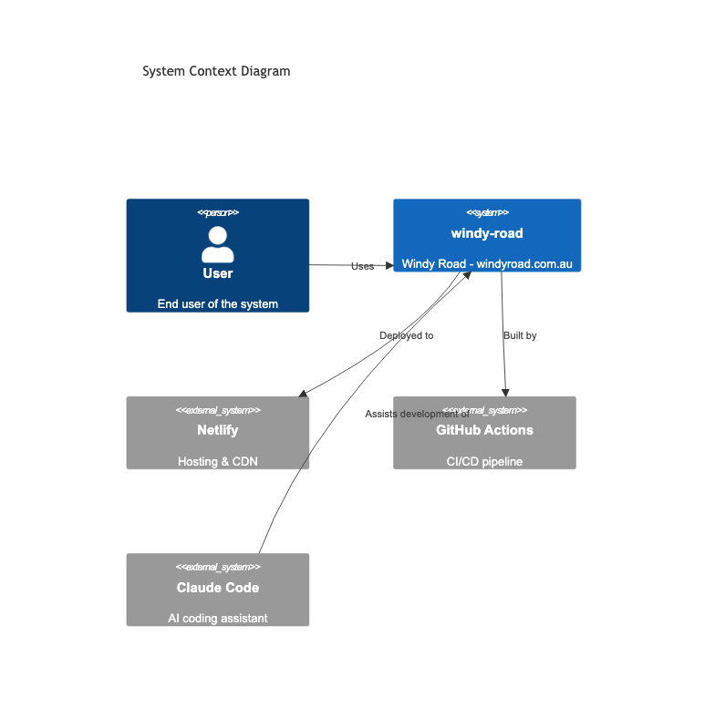
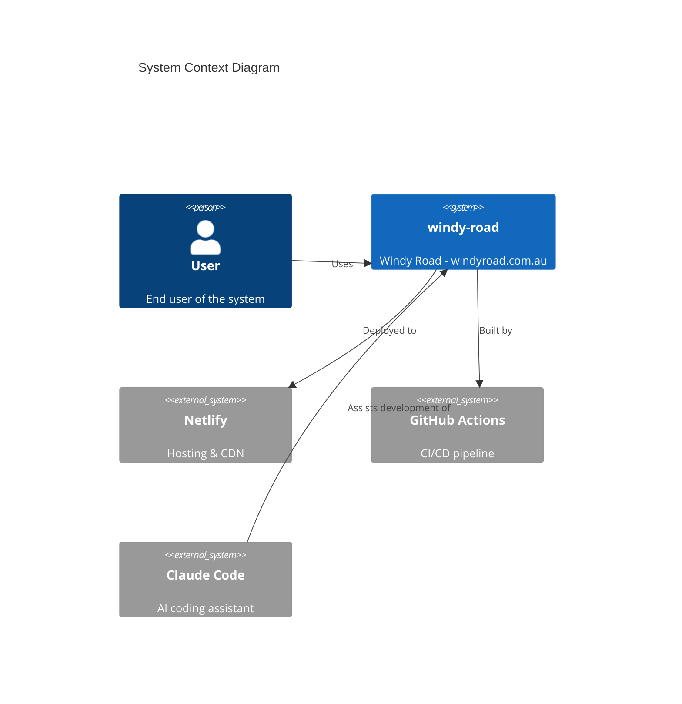
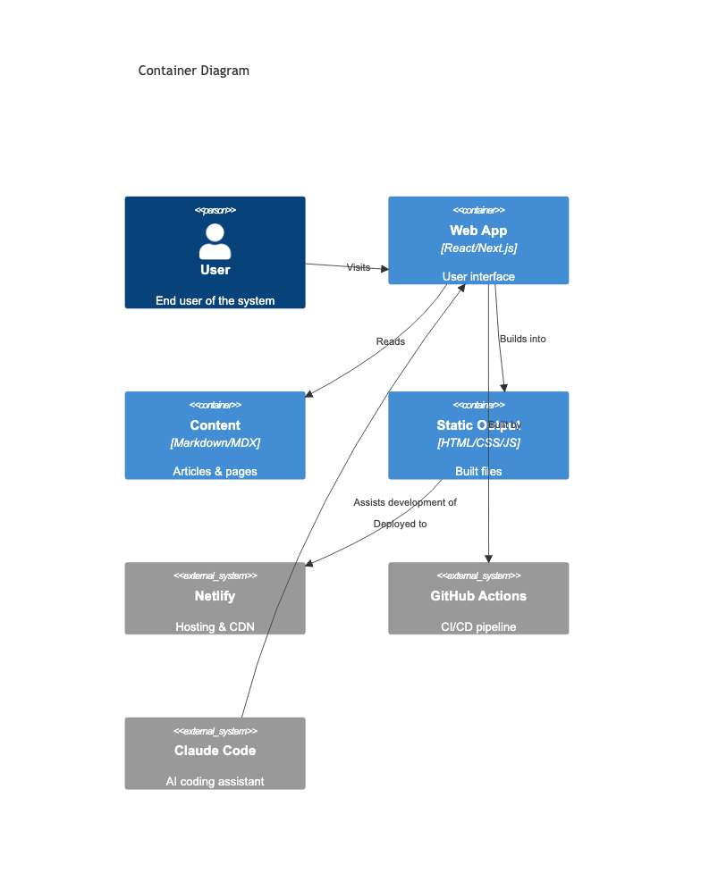
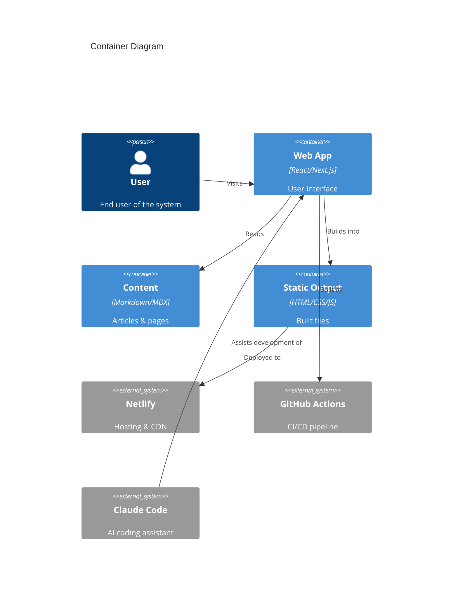
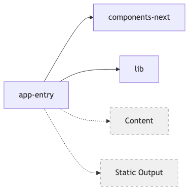
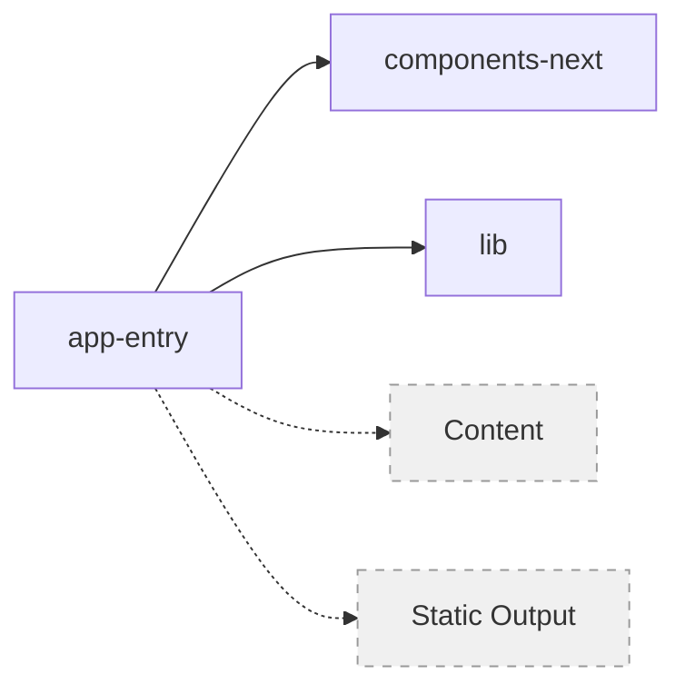
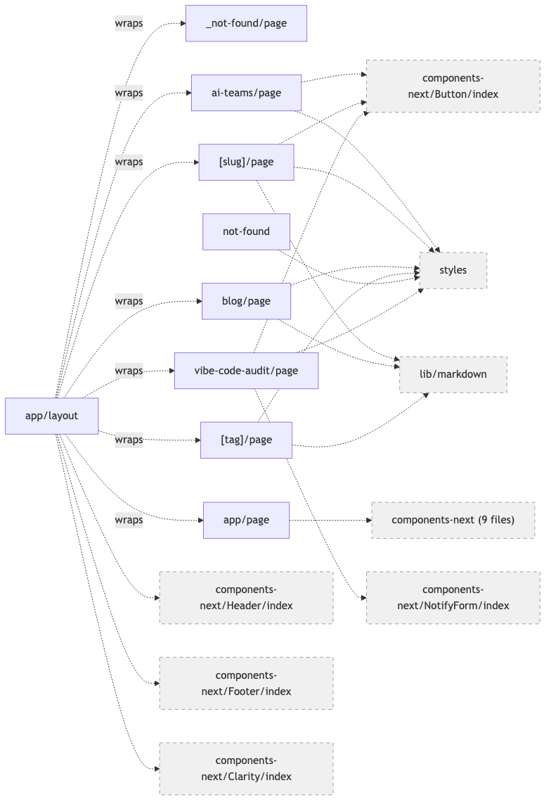
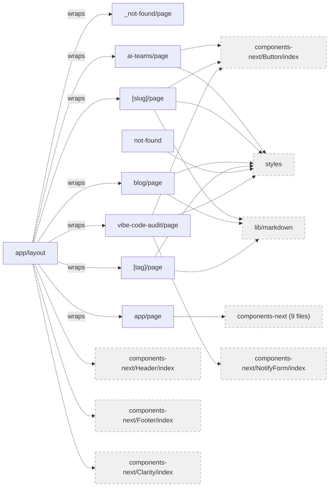
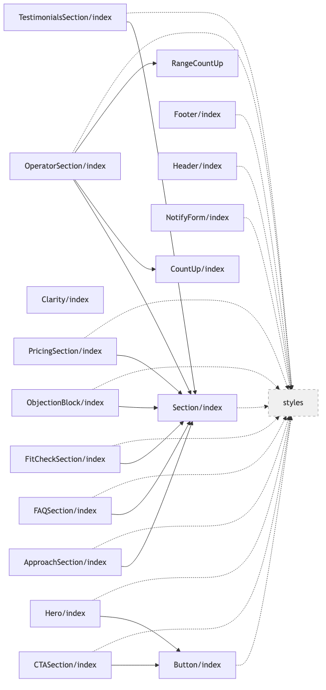
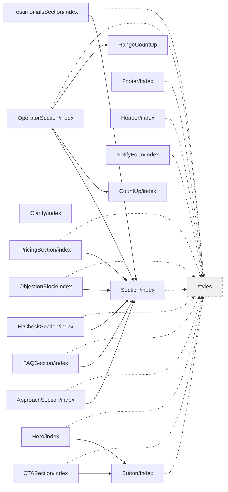

# C4 Architecture Model

All four C4 levels are generated from source code and project configuration.

## C1: System Context (Generated)

Shows the system, its users, and external dependencies detected from package.json and project configuration.

<!-- c1:generated:start -->

Mermaid source

<!-- c1:generated:end -->

## C2: Container View (Generated)

Shows the major containers (applications, data stores, content) detected from the project structure.

<!-- c2:generated:start -->

Mermaid source

<!-- c2:generated:end -->

## C3: Component View (Generated)

<!-- c3:generated:start -->

Mermaid source

<!-- c3:generated:end -->

## C4: Code View (Generated)

File-level dependency diagrams per component. Dashed arrows indicate cross-component imports. Grey nodes are external files.

<!-- c4:generated:start -->

### app-entry

Mermaid source

### components-next

Mermaid source

### lib

_Single file, see C3 view._

<!-- c4:generated:end -->

Regenerate: `/c4`
Check freshness: `/c4-check`
