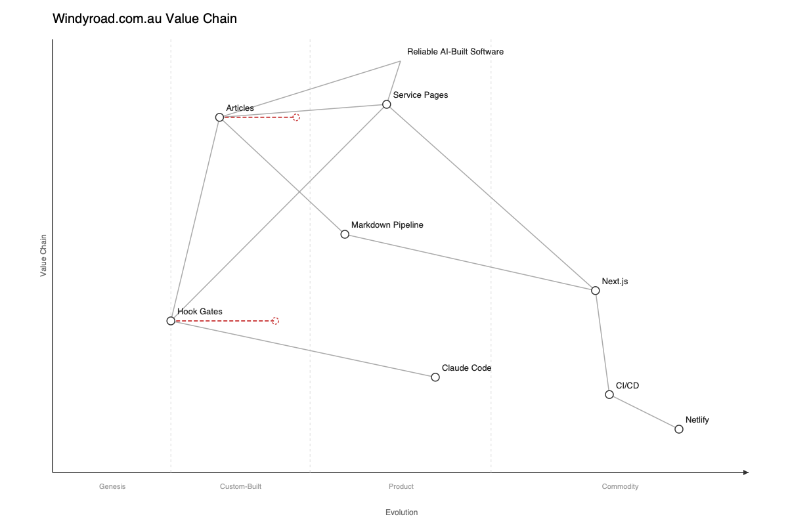

# Wardley Map

## Analysis

### Differentiation

Articles and Hook Gates are the only components a competitor cannot buy off the shelf. Both the content arm (Articles) and the consulting arm (Service Pages) depend on Hook Gates as their core method -- articles need the practices as subject matter, consulting needs them to deliver results. This convergence makes Hook Gates the single highest-leverage component, but also a single point of fragility: if the pattern becomes untenable, both revenue streams lose their foundation. Protect Hook Gates by keeping it portable across Claude Code versions and by documenting the pattern abstractly enough that it could survive an API change.

### Evolution

Hook Gates sit at the Genesis/Custom-Built boundary, evolving toward Custom-Built as the pattern expands to new enforcement domains. Articles are early Custom-Built, maturing from experimental posts into a coherent series. Service Pages depend on Articles for traffic (the map shows Service Pages->Articles), which means article investment has a multiplier effect: each article strengthens both the content arm and the sales pipeline. Prioritise article topics that demonstrate Hook Gates in new domains, since that advances both components simultaneously.

### Risk

Hook Gates depend on Claude Code (Product, 0.55), which is controlled by Anthropic and has no equivalent with the same hook API. If the hook API changes, Hook Gates need rewriting and published articles referencing specific hook behaviour become outdated -- both differentiators are hit simultaneously. Internally, if article output drops below one new post per month for two consecutive months, the reinforcing loop between practice and content stalls: traffic declines, consulting leads dry up, and there is less pressure to develop new hook patterns. The internal risk is the one the project owner controls and should monitor first.

### Decisions

Articles and Hook Gates packaging compete for the same resource: time. Both arms of the business depend on Hook Gates, which is evidence the pattern has real value worth extracting. But packaging should wait until the pattern is adopted by at least one project outside this codebase -- until then, articles have higher leverage because they create the audience and credibility that would make a packaged product viable. If no external adoption has occurred by the time the article series reaches fifteen posts, revisit whether the pattern's value is too context-specific to package.
