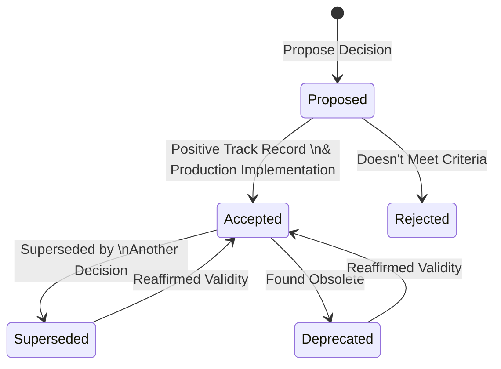

In the rapidly evolving world of software delivery, striking the right balance between innovation and consistent decision-making is paramount. Too much innovation without structure can lead to chaos, while an over-reliance on rigid decisions can stifle creativity. This article delves into a structured approach that seeks to harmonize these two ends of the spectrum.

## The Importance of Decision-making in Software Development

In the absence of a structured decision-making process, teams often face ambiguity, leading to inconsistencies and inefficiencies. To address this, many organizations have adopted MADR (Markdown Architectural Decision Records) – a tool designed to capture essential decisions.

## A Cultivator's Approach to Decision-making

Instead of relying on an architectural review board that assesses projects and initiatives using subjective criteria, consider establishing a system that generates decisions for teams to follow. This ensures decisions remain relevant and up-to-date.

Here's a step-by-step breakdown:

1. **Proposing Decisions**: Anyone can propose decisions.
2. **Criteria for Decisions**: Decisions should:
   - Be non-subjective.
   - Be easy to follow.
   - Have a clear title summarizing the decision.
   - List considered options and rationale behind the chosen option.
   - Mention existing decisions that it will supersede.
   - Include a "Reassessment Criteria" section to suggest future evaluations.
3. **Handling Proposals**: Don’t outright reject decisions. Guide teams to resubmit if they don't meet the criteria.
4. **Acceptance Criteria**: Decisions are accepted only after successful production implementation.
5. **Decision Evolution**: When a decision is accepted, the decisions it was designed to replace are marked as "superseded".
6. **Non-retroactive Decisions**: New decisions are forward-looking, meaning they don't apply to existing systems. Teams aren't required to retrofit their systems to comply with newer decisions.
7. **Following Accepted Decisions**: Teams must adhere to accepted decisions unless exempted.
8. **Following Proposed Decisions**: Teams must adhere to adhere to proposed decisions. However, they have options to navigate around this by:
   - Requesting and receiving an exemption.
   - Following a different proposed decision that competes with the original.
   - Proposing their own alternative decision.
9. **Deprecated Decisions**: Teams shouldn't use deprecated decisions for new initiatives unless granted an exemption.
10. **Encourage Exemptions**: While providing exemptions:
   - Ensure the team has a valid reason.
   - Ask the team to report the outcome.
   - If successful, encourage a new decision proposal.
11. **Periodic Reviews**: Regularly review decisions to determine obsolescence or reaffirm their validity.

## Visualizing the Decision-making Process

## Real-world Application

Consider a team that proposed using GraphQL over REST for their new API project. The decision remained "proposed" until another team successfully implemented it, showcasing its benefits. The decision then transitioned to "accepted," leading other teams to adopt GraphQL, while the previous decision to use REST was marked as "superseded."

## Benefits and Potential Pitfalls

This decision-making framework fosters innovation while ensuring consistency. Teams benefit from shared knowledge and best practices, resulting in efficient software delivery. However, it's essential to remain flexible, as a too rigid approach can stifle innovation. Proactively addressing and navigating these challenges ensures the system's continued success.

## Further Reading

For those interested in diving deeper into MADR or other decision-making frameworks, the following resources might be helpful:

- [Link to MADR Documentation]
- [Link to related article on decision-making frameworks]
- [Link to software delivery best practices]
